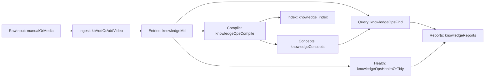

# ai-knowledge-vault

`ai-knowledge-vault` is a local-first AI knowledge vault template for Obsidian + Claude Code: Markdown-first `knowledge/` entries, index, and inbox.

Chinese documentation: [README.md](./README.md)

## What This Is

This repo is my updated take on an **AI knowledge base** I already run day to day. I wrote the longer story in Feishu ([knowledge notes, login required](https://mcndg9yue1j0.feishu.cn/wiki/D6rPw8SnVizcq3kbtIVcqtAKn3f)). Here I open-sourced the same direction as a cloneable layout, and folded in ideas **Andrej Karpathy** has shared publicly about LLM-maintained Markdown knowledge: ingest raw sources, compile a navigable wiki, iterate through Q&A and saved outputs, and run periodic health checks to keep the graph tidy.

## Key Features

- **Local-first**: content lives under `knowledge/*.md` and opens cleanly in Obsidian.
- **Inbox to entries**: manual capture under `inbox/manual/` (`pending` / `processed` / `review`); media under `inbox/video/` with optional transcription.
- **Index before deep reads**: start from `knowledge/_index.md` and `knowledge/concepts/`, then open `## Original Content` only when you need evidence.
- **Compile & navigate**: `compile` keeps concepts and index wiring fresh.
- **Searchable reports**: `find` can persist topic digests into `knowledge/reports/`.
- **Health & tidy**: `health` / `tidy` for structural checks and normalization.
- **Claude Code skill**: `.claude/skills/kb/` exposes `/kb` workflows (see [`.claude/skills/kb/SKILL.md`](./.claude/skills/kb/SKILL.md)).

## System Loop



Three practical flows:

1. **Ingest flow**: raw materials enter `inbox`, become `knowledge/*.md` entries  
2. **Compile flow**: `compile` builds concept pages and index  
3. **Query and health flow**: `find/health/tidy` produces reports and improves quality

## Layered Architecture

- **Content layer (source of truth)**: `knowledge/`
  - `knowledge/*.md`: timeline entries with source and distilled insights
  - `knowledge/concepts/`: compiled concept navigation layer
  - `knowledge/reports/`: reusable query/health outputs
- **Automation layer**: `.claude/skills/kb/`
  - `SKILL.md`: `/kb` command contract
  - `scripts/knowledge_ops.py`: `find/compile/health/tidy`
  - `scripts/video_ingest.py`: media ingest and transcription
- **Consumption layer**: Obsidian + Claude Code
  - Obsidian for browsing, linking, and visualization
  - Claude Code for incremental maintenance and research Q&A

## 5-Minute Quickstart (Minimum Loop)

### 1) Install

```bash
git clone https://github.com/dingshuxin353/ai-knowledge-vault.git
cd ai-knowledge-vault
pip3 install -r requirements.txt
```

### 2) Prepare one pending source

Put any Markdown file into `knowledge/inbox/manual/pending/`, or use `/kb add` in Claude Code.  
If you prepared multiple pending files, run `/kb process-pending` in Claude Code.

### 3) Compile concepts and index

```bash
python3 .claude/skills/kb/scripts/knowledge_ops.py compile
```

### 4) Run one query and persist a report

```bash
python3 .claude/skills/kb/scripts/knowledge_ops.py find "your-topic-keyword"
```

### 5) Run one health check

```bash
python3 .claude/skills/kb/scripts/knowledge_ops.py health
```

Expected outputs:

- entries: `knowledge/*.md`
- concepts: `knowledge/concepts/*.md`
- index: `knowledge/_index.md`
- reports: `knowledge/reports/*.md`

## Two-Layer Retrieval Model

- Layer 1: read `knowledge/_index.md` + `knowledge/concepts/*.md` to locate scope quickly
- Layer 2: open specific `## Original Content` blocks only when detail-level evidence is required

This layered retrieval often works well for small-to-medium personal vaults without heavy RAG infrastructure.

## Directory Map (Key Paths)

```text
knowledge/
  _index.md
  concepts/
  reports/
  inbox/
    manual/
      pending/
      processed/
      review/
    video/
      raw/
      transcripts/
      logs/
.claude/skills/kb/
docs/
```

Note: this repo is a template. The full content in `knowledge/concepts/` is usually generated incrementally after you run `compile`.

## Optional: Video/Audio Transcription

Requirements:

- `pip3 install dashscope`
- installed `ffmpeg` and `ffprobe`
- configured `.claude/skills/kb/config.local.json` (or `DASHSCOPE_API_KEY`)

Run:

```bash
python3 .claude/skills/kb/scripts/video_ingest.py
```

See [`docs/video-transcription.md`](./docs/video-transcription.md) for details.

## Who It Is For / Not For

Best for:

- people who want long-term research materials to compound into an AI-operable system
- people who want local, portable, and traceable Markdown-based personal wiki workflows
- people who want every query output to accumulate back into their vault

Probably not for:

- temporary note-taking with no structured maintenance needs
- users expecting zero-config hosted SaaS without local files/scripts

## Documentation Entry Points

- architecture: [`docs/architecture.md`](./docs/architecture.md)
- installation: [`docs/installation.md`](./docs/installation.md)
- video transcription: [`docs/video-transcription.md`](./docs/video-transcription.md)
- concepts directory: [`knowledge/concepts/README.md`](./knowledge/concepts/README.md)
- reports directory: [`knowledge/reports/README.md`](./knowledge/reports/README.md)
- manual ingest directory: [`knowledge/inbox/manual/README.md`](./knowledge/inbox/manual/README.md)
- video ingest directory: [`knowledge/inbox/video/README.md`](./knowledge/inbox/video/README.md)

## Suggested Next Steps

- add 5-10 source files into `knowledge/inbox/manual/pending/`
- run `compile + find + health` once and inspect how concepts and reports connect
- extend `.claude/skills/kb/scripts/` with your domain-specific strategies

## License

MIT
