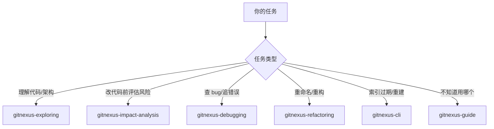

---
source:
- 微信公众号汇总（2026-05-11）
- .claude/skills/gitnexus（6 个 SKILL.md）
- Cursor 对话记录（2026-06-05）
tags:
- AI/Coding
- GitNexus
- 知识图谱
- MCP
- Claude-Code
- Cursor
- 代码搜索
- 影响分析
- Worktree
concepts:
- '[[concepts/Obsidian知识管理]]'
- '[[concepts/Claude协作工作流]]'
- '[[concepts/MCP工具链]]'
- '[[concepts/代码知识图谱]]'
related:
- '[[concepts/Obsidian知识管理]]'
- '[[concepts/Claude协作工作流]]'
- '[[concepts/MCP工具链]]'
- '[[concepts/代码知识图谱]]'
- '[[2026-03-10-Claude-Code实战指南]]'
- '[[2026-06-05-Effect-of-gitignore-on-gitnexus-skills]]'
title: GitNexus - 代码知识图谱与 AI 编码工作流
created: 2026-06-12
---
# GitNexus - 代码知识图谱与 AI 编码工作流

## 一、是什么

GitNexus 是 AI 编码 Agent 的**代码知识图谱**工具。把仓库解析成一张图（函数、类、调用关系、执行流程等），通过 MCP 协议喂给 Codex / Claude Code / Cursor，让 AI 在改代码前能先理解结构和影响范围，比单纯 grep 强很多。

- 官网：https://www.aivi.fyi/llms/gitnexus
- 本质：本地构建代码关系图，MCP 实时查询

**项目实际索引规模**（`detail-taro3` 仓库，截至 2026-06）：

| 指标 | 数量 |
|------|------|
| 符号节点 | 11,882 |
| 关系边 | 17,809 |
| 执行流程 | 210 |

## 二、核心能力：7 个 MCP 工具

| 工具 | 作用 | 典型用法 |
|------|------|----------|
| `query` | 进程感知混合搜索（BM25 + 语义向量） | "支付流程是怎么走的" |
| `context` | 360° 符号视图（上下游调用关系） | 看某个函数谁调用、调用谁 |
| `impact` | 爆炸半径分析（改这个符号会影响谁） | 改前评估风险 |
| `detect_changes` | Git diff 风险评估 | 提交前核对改动范围 |
| `rename` | 跨文件协调重命名 | 重构时避免漏改引用 |
| `cypher` | 原始图查询 | 复杂自定义查询 |
| `list_repos` | 全局仓库注册表 | 看哪些仓库已索引 |

**核心理念**：零 Token 索引，解析/聚类/图构建完全本地化，嵌入向量用本地 transformers.js 跑 Hugging Face 模型。

**多语言支持**：TypeScript / JavaScript / Python / Java / Kotlin / C# / Go / Rust / PHP。

## 三、6 个 Skill 路由表

`.claude/skills/gitnexus` 下有 6 个 skill，按任务场景分工：



### 3.1 `gitnexus-guide` — 总入口 / 工具手册
- 列出所有 MCP 工具、资源 URI、图谱 schema
- **起手式**：先读 `gitnexus://repo/{name}/context` 检查索引是否过期

### 3.2 `gitnexus-exploring` — 探索 / 理解代码
- **流程**：读 context → `query` 搜概念 → `context` 深入符号 → 读 process 资源
- **适用**："X 是怎么实现的？""认证流程在哪？"

### 3.3 `gitnexus-impact-analysis` — 改前评估
- **强制工作流**（`CLAUDE.md` / `AGENTS.md` 写死）
- **流程**：`impact({ target, direction: "upstream" })` → 按深度评估风险 → `detect_changes()` 核对
- **风险等级**：LOW / MEDIUM / HIGH / CRITICAL（auth、支付等关键路径）
- **深度判断**：d=1 会直接坏、d=2 很可能受影响、d=3 可能需要测试

### 3.4 `gitnexus-debugging` — 调试 / 追 bug
- **流程**：`query` 搜错误信息 → `context` 看 suspect 函数的上下游 → 读 process 追踪执行流 → 必要时 `cypher` 写自定义图查询
- **适用**："为什么 X 报错？""这个 500 从哪来？"

### 3.5 `gitnexus-refactoring` — 安全重构
- **核心**：`rename`（支持 `dry_run` 预览）
- **流程**：先 `impact` 摸清依赖 → 按「接口 → 实现 → 调用方 → 测试」顺序改 → `detect_changes` 验证
- **项目硬约束**：禁止用 find-replace 做重命名，必须用 `gitnexus_rename`

### 3.6 `gitnexus-cli` — 命令行维护

| 命令 | 作用 |
|------|------|
| `npx gitnexus analyze` | 构建/刷新索引 |
| `npx gitnexus status` | 查看索引新鲜度 |
| `npx gitnexus clean` | 删除索引 |
| `npx gitnexus wiki` | 从图谱生成文档 |
| `npx gitnexus list` | 列出已索引仓库 |

## 四、项目硬约束（合规流程）

在 `CLAUDE.md` / `AGENTS.md` 里写死了几条强制规则：

- 改任何函数/类/方法**前** → 必须跑 `gitnexus_impact`
- HIGH / CRITICAL 风险 → 必须警告用户
- 提交**前** → 必须跑 `gitnexus_detect_changes()`
- 重命名 → 必须用 `gitnexus_rename`，禁止全局 find-replace

因此 `gitnexus-impact-analysis` 和 `gitnexus-refactoring` 不是可选参考，而是改代码的**合规流程**。

## 五、安装与索引

### 国内镜像（解决 HuggingFace 拉取慢）

```bash
HF_ENDPOINT=https://hf-mirror.com npx gitnexus analyze --embeddings
```

### `.gitnexus` 目录是什么

```
.gitnexus/
├── meta.json        # 索引元数据（仓库路径、最后提交、统计）
├── lbug             # 图数据库文件
└── parse-cache/     # 文件解析缓存（加速增量重建）
```

**建议加进 `.gitignore`**：本地构建产物，类似 `node_modules`，每人本地 `analyze` 即可。

## 六、Worktree 与索引共享

### 在 worktree 中使用 GitNexus

| 能力 | worktree 中是否有效 | 原因 |
|------|---------------------|------|
| `query` / `impact` / `context` | ✅ 有效 | MCP 服务器全局注册在 `~/.gitnexus/registry.json`，按 `repoPath` 索引 |
| `detect_changes` | ⚠️ 可能不准 | worktree 和主目录的 diff 是分开的 |
| Skill 文件本身 | ❌ 默认不可用 | worktree 是独立目录，不含 `.cursor/skills/` / `.claude/skills/` |
| `npx gitnexus analyze` | ⚠️ 需单独运行 | 在 worktree 跑会建新索引，可能名称冲突 |

### 两种用法

**1. 软链接共享（推荐，分支差异小时）**

```bash
# 在 worktree 根目录
ln -s /Users/.../detail-taro3/.gitnexus .gitnexus
```

**优势**：不重新分析、不产生注册冲突。
**弊端**：
- 在 worktree 跑 `analyze` 会**覆盖**主仓库索引（共享同一份数据）
- worktree 分支代码与主仓库差异大时，索引内容不匹配
- 主仓库执行 `gitnexus clean` 后，软链接变悬空

**恢复**（删除软链接，不影响主仓库）：

```bash
rm .gitnexus   # 不要用 rm -rf .gitnexus/（会删真实目录）
```

**2. 单独 analyze（分支差异大时）**

在 worktree 目录跑 `npx gitnexus analyze`，会：
- 在 worktree 根目录生成新的 `.gitnexus/`
- 在 `~/.gitnexus/registry.json` 新增一条记录
- **风险**：两个同名仓库（`detail-taro3`）可能注册冲突，MCP 工具按 name 查找会出错

## 七、GitNexus vs Graphify 怎么选

| 维度 | GitNexus | Graphify |
|------|----------|----------|
| 定位 | AI Agent 的代码地图 | 跨模态知识编译器 |
| 关注点 | 调用链、爆炸半径、类型解析 | 代码/文档/论文/图像/视频统一图谱 |
| 索引开销 | 零 Token | AST 零开销，语义通道有消耗 |
| 触发方式 | MCP 协议 | Skill 触发 |
| 输出 | 实时查询的结构化上下文 | Git 友好的静态产物 |

**选择建议**：
- 精准代码问题 → GitNexus（"修改这个函数会影响哪些模块？"）
- 语义知识问题 → Graphify（"这段实现和论文哪个部分对应？"）
- 复杂混合问题 → 两者叠加

## 八、实战场景

### 场景 1：接手陌生代码库
```
1. gitnexus-guide → 看工具列表
2. gitnexus-exploring → query 搜核心功能
3. context 看关键 class 的上下游
```

### 场景 2：改函数前评估风险
```
1. gitnexus-impact-analysis → impact 看爆炸半径
2. 评估风险等级（HIGH/CRITICAL 必须警告用户）
3. 改代码
4. 提交前 detect_changes 核对
```

### 场景 3：重命名重构
```
1. gitnexus-refactoring → rename dry_run 预览
2. 确认无误后真正执行
3. detect_changes 验证
```

## 九、关键资源

- 官网：https://www.aivi.fyi/llms/gitnexus
- MCP 工具 schema：`.claude/skills/gitnexus/gitnexus-guide/SKILL.md`
- 项目 CLAUDE.md：含合规流程硬约束
- 相关对比：Graphify、Understand-Anything (code-review-graph)、zread.ai

## 标签

#AI/Coding #GitNexus #知识图谱 #MCP #Claude-Code #Cursor #代码搜索 #影响分析 #Worktree
