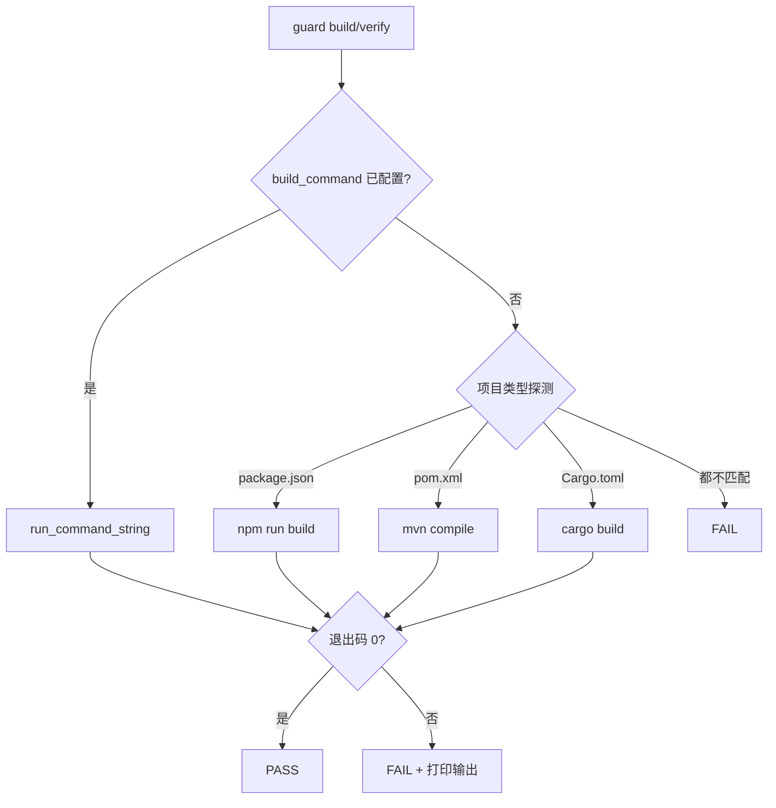

## 确认设计方案时候看什么

  

按你的阅读顺序，我建议只看这 3 个：

  

1. `openspec/changes/flagship-store-lead-popup-oem/.specdrive/handoff/brainstorm-summary.md`

先快速看最终结论，几分钟就能知道方案是不是对的。

  

2. `docs/superpowers/specs/2026-06-15-flagship-store-lead-popup-oem-design.md`

再看完整设计，重点确认交互流程、协议兜底、入口映射、RN 键盘处理。

  

3. `openspec/changes/flagship-store-lead-popup-oem/specs/flagship-store-lead-popup/spec.md`

最后看需求约束，确认有没有写错业务规则或漏掉边界。

  

如果你只想最快做人工确认，看前两个基本就够；第三个用于做“规则级”复核。

## build_pause枚举值
| 枚举值          | 含义                 |
| ------------ | ------------------ |
| `null`       | 无暂停，构建阶段正常推进       |
| `plan-ready` | 计划已就绪，暂停等待人工审核后再执行 |
当 `build_pause` 被设为 `plan-ready` 时，意味着计划已经生成完毕，但构建执行尚未开始——系统会在此处暂停，等待人工审核确认。这是一种**人工审批门控（human-in-the-loop）**的设计，将状态推进与技能编排解耦，允许项目在进入实际构建前强制执行人工审核。

# `build_command` 用法与原理

## 它是什么

`build_command` 是 `.specdrive.yaml` 里的**可选项目级配置字段**，存一条 shell 命令字符串。`specdrive-guard.sh` 在 build / verify 阶段会执行它，用来判断「项目能否构建/通过验证」。

配对字段：`verify_command`（verify 阶段优先用；未配置则回退到 `build_command` 或自动探测逻辑）。

---

## 原理：读取 → 执行 → 回退

### 1. 读取优先级

`project_config_value` 按顺序查找，**先命中先用**：

```
change 的 .specdrive.yaml
    ↓ 没有
仓库根 .specdrive.yaml → comet.yaml → .comet.yml → comet.yml
    ↓ 都没有或为 null
自动探测（见下）
```

### 2. 在哪个阶段用

| 阶段 | guard 检查项 | 实际调用 |
|------|-------------|----------|
| `build --apply` | `Build passes` | `build_passes()` → 读 `build_command` |
| `verify --apply` | `Build passes` | `verification_command_passes()` → 先读 `verify_command`，没有再走 `build_passes()` |

### 3. 未配置时的自动探测

guard 依次尝试：

1. `package.json` 有 `"build"` script → `npm run build`
2. 有 `pom.xml` → `mvn compile`（或 `./mvnw`）
3. 有 `Cargo.toml` → `cargo build`
4. 都不匹配 → **失败**

可用环境变量 `SPECDRIVE_SKIP_BUILD=1` 跳过构建检查。

### 4. 执行方式

命令通过 `bash -lc` 执行，并做注入防护：

- **禁止**：`;` `|` `&` `$` `` ` ``
- **允许**：字母数字、空格、`-` `_` `.` `:` `/`、引号

含 `|` 的 Jest `testPathPattern` 会被 guard **直接拒绝**；复杂命令应放进包装脚本。

---
## build_command的用法和原理
## 用法：怎么配

### 配置位置（三选一或组合）

**A. 仓库根（推荐，全项目生效）**

```yaml
# .specdrive.yaml 或 comet.yaml
build_command: pnpm build
verify_command: pnpm test
```

**B. 单个 change**

```bash
"$SPECDRIVE_BASH" "$SPECDRIVE_STATE" set <change-name> build_command "pnpm build"
```

**C. 不配置** — 依赖 guard 自动探测（通常只有 `npm run build` / Maven / Cargo）

### 不会自动生成

- `specdrive-state init` **不写** `build_command`
- 没有脚本根据改动文件推断测试路径
- README 里的 `build_command: null` 只是示例，表示「可选、可不存在」

---

## Agent / Skill 层面的预期

| 要求 | 有/无 | 出处 |
|------|-------|------|
| build 退出前**显式跑**构建/测试 | ✅ 有 | `specdrive-build` 退出条件 |
| Agent **写入** `build_command` | ❌ 无 | 所有 skill 均未要求 |
| guard **读取**已配置的命令 | ✅ 有 | `specdrive-build` + `specdrive-guard.sh` |

实际流程：

```
Agent 自己跑 npm test / pnpm build ...（skill 要求）
        ↓
guard --apply 再跑一遍（用 build_command 或自动探测）
        ↓
通过 → phase 推进到 verify
```

若 Agent 把 `npm test -- --testPathPattern=...` 写进 YAML，那是**自行行为**，不是 skill 规定；且含 `|` 时 guard 会报错。

---

## 与 `verify_command` 的分工

```
verify 阶段:
  verify_command 有值? → 执行 verify_command
       ↓ 无
  build_command 有值? → 执行 build_command
       ↓ 无
  自动探测 npm/mvn/cargo
```

典型配法：

- `build_command: pnpm build` — 只编译
- `verify_command: pnpm test` — 验证跑测试

---

## 一张图



---

## 实践建议

1. **稳定项目**：在仓库根 `.specdrive.yaml` 写死 `build_command` / `verify_command`，避免 guard 猜错。
2. **复杂测试命令**：写 `scripts/verify.sh`，`build_command` 只指向脚本路径。
3. **不要指望 Agent 自动写**：skill 只要求「跑」，不要求「写」；需要规范就补 skill 或在项目 README 里说明。
4. **改字段用脚本**：change 级用 `specdrive-state set`，不要手改 `.specdrive.yaml`（项目根配置除外）。

---

- 本次回复未使用任何 skill。