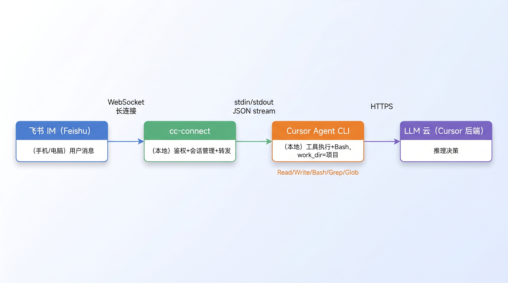

# cc-connect 工作原理

> 本文以 cc-connect 为核心，讲清楚它的工作机制。Cursor Agent CLI 作为执行层嵌入讲解（是什么、怎么协作、怎么用），飞书 IM 作为典型平台举例。
>
> 基于实际使用 cc-connect + Cursor Agent CLI + 飞书 IM 联调时的对话整理

---

## 一、cc-connect 工作原理（核心）

### 三层架构



**cc-connect**（中间层，本地进程）：跟飞书 IM 保持 WebSocket 长连接；维护用户 ↔ 会话映射（`~/.cc-connect/sessions/`）；处理权限检查（`allow_from` / `admin_from`）；把消息拼成完整 prompt，spawn 子进程喂给 Cursor Agent CLI；监听 Cursor Agent CLI 的 JSON stream 输出，实时回传飞书（卡片原地更新）。

**Cursor Agent CLI**（执行层，本地子进程）：调 Cursor 后端 LLM 服务；给 LLM 提供工具列表（Read/Write/Edit/Bash/Grep/Glob/...）；执行 LLM 决策的工具调用；把每步输出流式回给 cc-connect。

**LLM 云**（Cursor 后端）：推理决策；接收 prompt + 工具调用历史，输出下一步动作；不直接动文件，只"说要用什么工具"。

### cc-connect 在中间做什么

1. **消息进出**：跟飞书保持 WebSocket 长连接，收到消息后解析、转发
2. **会话管理**：维护用户 ↔ session 映射（`~/.cc-connect/sessions/`），每次新消息拼历史
3. **权限检查**：`allow_from`（谁能用）、`admin_from`（谁能跑特权命令）
4. **spawn 子进程**：调 Cursor Agent CLI，通过 stdin 喂 prompt，通过 stdout 收 stream
5. **流式回传**：监听 Cursor Agent CLI 的 JSON stream，实时更新飞书卡片

### 为什么 cc-connect 不能直接调 IDE

- IDE 是 GUI 进程，启动慢、占内存、不能用 stdout/JSON 通信
- CLI 是无 UI 的纯命令行，spawn 快、退出干净、stdout 是机器可读的 JSON
- 同一个 Agent 服务，不同入口——CLI 是给自动化工具用的

---

## 二、一条消息的完整生命周期（核心）

用户在飞书发："在 src/components 下加个 EmptyState 组件"

### ① 飞书 → cc-connect

- 飞书 WebSocket 长连接把消息推过来
- cc-connect 解析：用户是谁（open_id）、会话 ID、文本内容

### ② cc-connect 处理

- 检查 `allow_from` 白名单
- 查 session 表（`~/.cc-connect/sessions/my-project_*.json`），拿会话 ID
- 拼历史对话 + 新消息成完整 prompt
- 通过子进程 stdin 喂给 Cursor Agent CLI：

```bash
agent --print \
      --output-format stream-json \
      --resume <agent_session_id> \
      -p "在 src/components 下加个 EmptyState 组件"
```

### ③ Cursor Agent CLI 干活（核心：tool use loop）

LLM 不能直接动文件，它只能"说话"——决定要调什么工具。Cursor Agent CLI 给 LLM 提供工具列表，循环执行：

```
   用户 prompt
       │
       ▼
   ┌─────────────────────────────────────┐
   │  调 LLM                              │
   │  input: system + history + prompt    │
   │  output: 思考 + tool_call             │
   └──────────────┬──────────────────────┘
                  │
                  ▼
        LLM 说 "我要用 Read 工具"
        Read(path="src/components/index.ts")
                  │
                  ▼
        Cursor Agent 执行 Read
        拿到文件内容
                  │
                  ▼
        把结果回传给 LLM
                  │
                  ▼
        LLM 说 "我要用 Write 工具"
        Write(path="src/components/EmptyState.tsx", content=...)
                  │
                  ▼
        Cursor Agent 写文件
                  │
                  ▼
        ... 循环 ...（可能穿插 Bash 跑测试、Grep 找代码）
                  │
                  ▼
        LLM 输出纯文本（最终回复）
        "已创建 EmptyState.tsx，包含..."
                  │
                  ▼
        Cursor Agent 退出
```

LLM 在循环里做的事：分析 → 决定要读哪些文件 → 看代码 → 决定怎么写 → 写 → 跑测试 → 报错就修 → 直到满意。

### ④ Cursor Agent CLI → cc-connect

- 工具调用和 LLM 思考以 JSON stream 输出到 stdout
- cc-connect 监听 stdout，实时解析每条事件

### ⑤ cc-connect → 飞书

- 流式回传：每收到一条 JSON 就更新飞书卡片（"🤔 思考中..." → "🔧 Read src/..." → "✅ 已加好..."）
- 最终回复完成，发完整消息

---

## 三、关键概念

### session（两层）

- **cc-connect 的 session**：`s1`、`s2`... 对应不同的飞书聊天/用户，存在 `~/.cc-connect/sessions/`
- **Cursor Agent 的 agent_session_id**：传给 `--resume` 让 Cursor Agent 接上次的上下文
- 用户发 `/new` → cc-connect 生成新 session ID → Cursor Agent 开新对话

### work_dir

- Cursor Agent CLI 启动时 `cd` 到那个目录
- 工具执行时所有相对路径基于那个目录
- `.cursor/rules`、`.cursorrules`、项目根配置都从那读
- cc-connect 的 `config.toml` 里 `[projects.agent.options] work_dir = "..."` 配置

### mode 和 trust

- **trust**：Cursor Agent CLI 自己的安全机制，跟 cc-connect / Cursor IDE 都无关。首次访问未 trust 目录会弹交互式确认等待 stdin。无 stdin 时（如 cc-connect 子进程）就死锁
- **`--force` / `-f` / `--yolo`**：跳过 trust 检查 + 自动放行所有工具调用
- **`--trust`**：只跳过 trust 检查，工具调用还是会问
- **cc-connect 配置**：`mode = "force"` 让 cc-connect 自动给 spawn 的 agent 加 `--force`；`mode = "default"` 不加，自己跑会卡

⚠️ 关键事实：trust 是 Cursor Agent CLI 自己的机制，跟 cc-connect / IDE 都是分开的。`mode = "force"` 只是让 cc-connect 替你自动传 `--force`，不是全局设置。

### 工具列表（Cursor Agent CLI 固定的）

- `Read` / `Write` / `Edit` / `Glob` / `Grep` / `Bash` / `WebFetch` / ...
- LLM 不能调自己"想出来"的工具，只能从这堆里选
- 工具能力是 Cursor Agent CLI 自带的，LLM 只是"调它"

### LLM 是谁

- Cursor Agent 默认用 Cursor 后端的模型（具体哪个看你 Cursor 账号配的）
- 可传 `--model gpt-5` / `--model sonnet-4` 等切换
- cc-connect 的 config 里写 `model = "..."`，但要看 Cursor 后端是否认这个模型名

---

## 四、Cursor Agent CLI（执行层简介）

### 一句话定义

**Cursor Agent CLI = Cursor 后端 Agent 服务的命令行壳子**，跟 Cursor IDE 里的 Chat/Composer 共用同一个大脑（同一个 Agent 服务、同一套工具、同一个云端 LLM），但入口是终端，可以被任意程序当函数一样 spawn 调用。

### 跟 Cursor IDE 对话框的区别

| | Cursor IDE 对话框 | Cursor Agent CLI |
|---|---|---|
| 入口 | 编辑器里点开 Chat/Composer | 终端跑 `agent` 命令 |
| 界面 | 完整 IDE UI、diff 视图、Accept/Reject 按钮 | 纯文本输出，无 UI |
| 能看到什么 | 当前打开的文件、git status、Cursor 索引 | 只有 `work_dir` 里的文件 + 命令传入的 prompt |
| 改代码的方式 | IDE 内联 diff 让你审核 | 直接落盘 |
| 触发方式 | 人在电脑前操作 | 可以被任何程序 spawn 子进程调 |
| 适合场景 | 你坐在工位边看代码边改 | 你在外面（飞书/远程），或想把 AI 集成进自动化 |
| **后端服务** | **同一个** | **同一个** |

底层大脑、模型、工具集完全一样。区别只在入口、上下文丰富度、改动审核方式。

### 为什么 cc-connect 必须走 CLI

cc-connect 是个无 UI 的本地服务，要触发 Agent 干活必须 spawn 子进程。IDE 的对话框是 GUI，没法被 spawn。CLI 就是给外部集成留的"窄门"。

---

## 五、Cursor Agent CLI 怎么使用（实操参考）

### 安装和认证

```bash
npm install -g @anthropic-ai/cursor-agent
agent login      # OAuth：终端打印 deep link，浏览器授权后凭证存到 ~/.cursor/.cli-data/
```

OAuth 凭证（CLI 用的）和 Cursor IDE 桌面登录凭证是分开的，IDE 登录过不代表 CLI 登录过。

`agent login` 在非交互 shell 里是阻塞的，必须 `&` 后台跑再去浏览器授权：

```bash
NO_OPEN_BROWSER=1 agent login &
# 终端打印 https://cursor.com/loginDeepControl?... 链接
# 浏览器打开 → 自动跳到 Cursor 授权页（已登录直接同意）→ 完成
```

### 常用命令

| 命令 | 干啥 |
|------|------|
| `agent --version` | 看版本（不触发 API 调用） |
| `agent --help` | 看完整参数 |
| `agent login` | OAuth 登录 |
| `agent --print -p "..."` | 非交互执行一条 prompt |
| `agent --print -p "..." --resume <id>` | 接上次的会话继续 |

### 关键参数对照

| 参数 | 干啥 |
|------|------|
| `--print` / `-p` | 非交互模式（必加，否则进 TUI 聊天界面） |
| `-p <prompt>` | 传入 prompt |
| `--output-format text` | 纯文本输出（默认） |
| `--output-format json` | 完整 JSON 输出 |
| `--output-format stream-json` | 流式 JSON（一行一个事件，cc-connect 用） |
| `--force` / `-f` / `--yolo` | 跳过 trust 检查 + 自动放行所有工具 |
| `--trust` | 只跳过 trust 检查，工具调用还是会问 |
| `--resume <chatId>` | 接上次的 agent 会话 |
| `--continue` | 续接最后一个会话 |
| `--model <name>` | 指定模型（gpt-5 / sonnet-4 等） |
| `--stream-partial-output` | 流式输出文本（搭配 stream-json） |

### 三种典型用法

**1. cc-connect 触发（自动，不用你管）**

```bash
agent --print --output-format stream-json --resume <agent_session_id> -p "..."
```

cc-connect 在每次飞书消息来时内部 spawn 这一条。`--resume` 保证 Cursor Agent 接续之前的上下文。

**2. 你自己终端调试**

```bash
agent --print -p "说一句话证明你在线"
```

不加 `--force` 时，第一次访问 `work_dir` 会弹 trust 提示，CLI 在 stdin 等你按 Enter。无 stdin（如 ssh 远程 / 自动化脚本）就死锁。

**3. 自己用又想跳过 trust**

```bash
agent --print --force -p "..."
```

或者加 alias 一劳永逸（推荐）：

```bash
# 加到 ~/.zshrc
alias agent='agent --force'

# 之后直接 agent -p "..." 就好
```

### 验证是否登录

```bash
agent --print -p "说一句话证明你在线"
```

能正常回复 = 登录成功；报 `Authentication required` = 需要 `agent login`。

### 输出格式选择

| 场景 | 格式 |
|------|------|
| 自己在终端看 | `--output-format text`（默认） |
| 写脚本解析结果 | `--output-format json` |
| 想看实时进度（"typing..."） | `--output-format stream-json --stream-partial-output` |
| cc-connect 集成 | `--output-format stream-json` |

### 为什么 cc-connect 必须用 `--print` + `stream-json`

- **`--print`**：非交互模式（CLI 默认是 TUI 聊天界面，等你打字）
- **`--output-format stream-json`**：把每步输出成 JSON 行（一行一个事件），cc-connect 可以实时解析和流式回传

如果用默认 `text` 输出，cc-connect 没法区分"思考"、"工具调用"、"最终回复"，只能拿到一坨文本，体验差很多。

---

## 六、一句话总结

**Cursor Agent 是大脑，IDE 是豪华办公室，CLI 是打工宿舍。** cc-connect 不关心 Cursor Agent 住哪儿，它只关心怎么 spawn 子进程把 prompt 喂进去、把 JSON 收回来。CLI 就是给它留的窄门。

---

**相关文档：**
- cc-connect 避坑指南（实战 7 条）：`pending/cc-connect-pitfalls.md`
- cc-connect 官方：https://github.com/chenhg5/cc-connect
- Cursor Agent CLI 帮助：`agent --help`